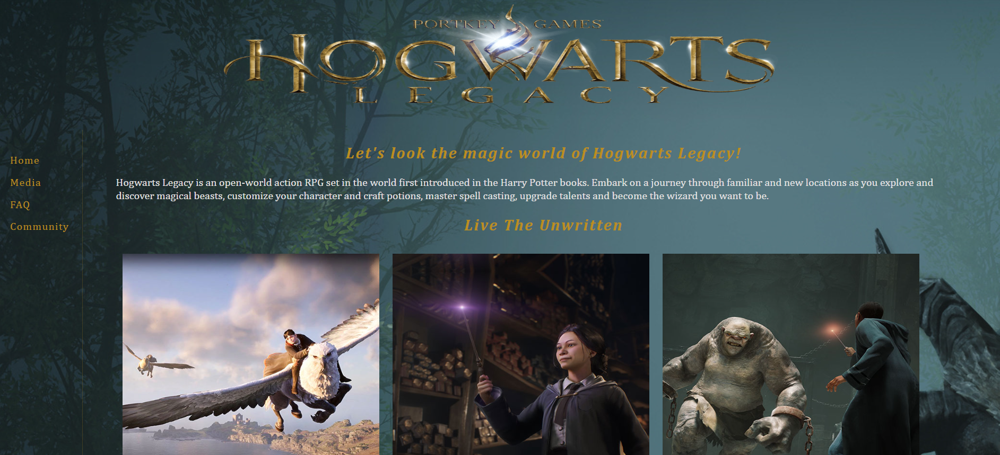

# 🎮 VGames World - Hogwarts Legacy Fan Page

## 📌 Project Overview

**VGames World** is a **fan website** dedicated to the game *Hogwarts Legacy*. The site provides **detailed information**, immersive **images**, and **interactive sections** that highlight the game’s mechanics and magical world.

Developed as an **individual college assignment**, this project showcases **web development, responsive design, and UI/UX skills**.

---

## 🚀 Features

- 🏰 **Game Overview** – Introduces the world, mechanics, and lore of *Hogwarts Legacy*.
- 📸 **Image Gallery** – Showcases key visuals and in-game moments.
- 🎨 **Responsive Design** – Optimized for different screen sizes using **flexible layouts** and **media queries**.
- 📑 **Multiple Sections** – Provides structured content with a **user-friendly navigation menu**.

---

## 🛠 Technologies Used

- **HTML5** → Provides the structure for the website.
- **CSS3** → Enhances styling, animations, and responsiveness.
- **Responsive Web Design** → Implements **media queries** and **flexible grid layouts**.

---

## 🎯 Project Purpose

This project was developed as part of a **college assignment** to enhance skills in:

- ✅ Structuring content effectively using **HTML & CSS**.
- ✅ Implementing **responsive design** for a seamless user experience across devices.
- ✅ Creating an **engaging fan page** with visually appealing multimedia elements.

---

## 📂 Project Structure

```
📁 vgames_world
 ├── 📁 css/               # Stylesheets
 │   ├── site.css         # Main styling file
 ├── 📁 imgs/              # Image assets
 ├── 📁 pages/             # Webpages for different sections
 │   ├── index.html       # Homepage
```

---

## 📌 Prerequisites

To view the website, ensure you have:

- A **modern web browser** (*Chrome, Firefox, Edge, Safari*).
- **No additional setup required**.

---

## 🏃‍♂️ How to Run the Project

1️⃣ **Open** `index.html` in a web browser.  
2️⃣ **Navigate** through the website using the **interactive menu**.  
3️⃣ **Explore** the content, images, and features of *Hogwarts Legacy*.

---

## 🖼️ Screenshots

| VGames World |  
|--------------|  
|  |  

---

## 📜 License

This project was developed for **educational purposes** as part of a **college assignment**.

---

## 💼 Author

👤 **Juan Jacobo Florez Monroy**  
🌐 **Portfolio**: [jjacobo95.com](https://jjacobo95.com)  
🐙 **GitHub**: [github.com/jjacoboflorez95](https://github.com/jjacoboflorez95)  